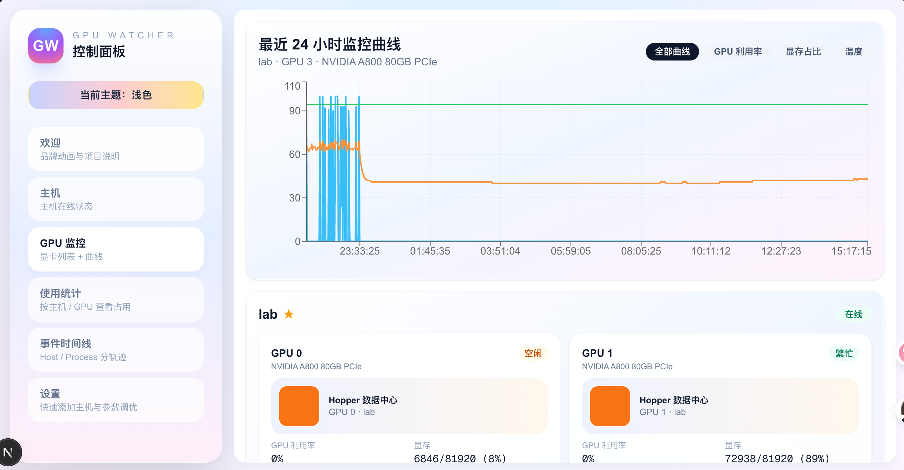

# GPU Watcher

Next.js 控制面板，用一台主机通过 SSH 轮询多台 GPU 机器的 `nvidia-smi`，记录显卡实时状态、进程上下线、主机离线情况，并把 GPU 空闲或主机离线事件发送到 Telegram。

> 有多台服务器并行跑实验，之前必须逐台 SSH 查看 `nvidia-smi` 才能知道有哪些空闲 GPU，非常低效。GPU Watcher 通过单一面板聚合所有主机状态，确认空闲资源和排查任务只需看一个页面。

更详细的设计与实现笔记见 `docs/` 目录：
- `docs/overview.md`：背景/目标/架构/数据流/界面设计
- `docs/implementation.md`：服务端与前端模块拆解、API、运行方式与排障说明



## 功能
- 每分钟并行执行 `nvidia-smi`，采集显存、利用率、温度、进程列表，写入本地 SQLite (`data/gpu_watcher.db`)。
- 计算事件：进程上线 / 下线、GPU 连续 5 分钟显存占用 < 10% 视为空闲、主机离线 / 恢复。
- GPU 空闲、主机离线即时推送 Telegram（可选）。
- 仪表盘展示三台机器当前状态，并提供 6 小时利用率/显存/温度曲线及事件时间线。

## 依赖
- Node.js 18+
- 每台 GPU 主机可通过当前主机 SSH 访问，并安装 `nvidia-smi`
- （可选）Telegram Bot 与 chat id

## 配置
在项目根目录创建 `.env.local`（Next.js 自动加载）：

```bash
TELEGRAM_BOT_TOKEN=YOUR_TELEGRAM_BOT_TOKEN
TELEGRAM_CHAT_ID=YOUR_CHAT_ID
# 可选：关闭通知（例如测试环境无外网）
# TELEGRAM_DISABLE_NOTIFICATIONS=true

# 轮询主机定义，支持 local 或 ssh（JSON 字符串）
GPU_WATCHER_HOSTS=[{"id":"lab","label":"lab","connection":{"type":"ssh","host":"211.71.15.50","username":"farong","privateKeyPath":"~/.ssh/id_rsa"}},{"id":"4090","label":"4090","connection":{"type":"ssh","host":"10.134.48.81","username":"farong","privateKeyPath":"~/.ssh/id_ed25519"}},{"id":"5090","label":"5090","connection":{"type":"ssh","host":"10.134.48.74","username":"farong","privateKeyPath":"~/.ssh/id_ed25519"}}]

# 可选：调整采样与空闲判定
GPU_WATCHER_POLL_INTERVAL_MS=60000        # 默认 60s
GPU_IDLE_WINDOW=5                         # 连续 5 次
GPU_IDLE_THRESHOLD=0.1                    # 显存占比 10%
```

说明：
- `type: "local"` 会直接在本机运行命令；`type: "ssh"` 使用 `ssh2`，默认从 `~/.ssh/id_ed25519` 读取私钥（也支持 SSH Agent，或通过 `privateKeyPath` 指定例如 `~/.ssh/id_rsa`）。
- `GPU_WATCHER_DB_PATH` 可自定义数据库文件位置（默认 `data/gpu_watcher.db`）。
- 如果机器无法连接，会写入事件 `host_offline` 并推送 Telegram；恢复时写入 `host_online`。

## 开发 / 运行
```bash
npm install
npm run dev      # http://<本机IP>:8005

# 生产
npm run build
npm start        # 以 NODE_ENV=production 启动 (默认端口 8005，监听 0.0.0.0)
```

保持 Node 进程常驻（PM2、systemd、Docker 均可）。数据库文件位于 `data/`，默认被 `.gitignore` 忽略。

## 结构
- `src/server/`：SQLite 存储、SSH 执行、nvidia-smi 解析、轮询与 Telegram 通知。
- `src/app/api/*`: 状态 / 事件 / 曲线接口，供前端 SWR 轮询。
- `src/components/dashboard/`: 客户端仪表盘，含曲线图（Recharts）与事件列表。

## 注意事项
- 轮询间隔 + nvidia-smi 执行时间 < 60 秒，否则下一轮会等待上一轮完成。
- 请确保运行进程用户可以读取 SSH 私钥，并且相应主机的 `~/.ssh/config` 已允许无口令登录。
- Telegram 推送失败会在日志里输出，并继续系统运行。
